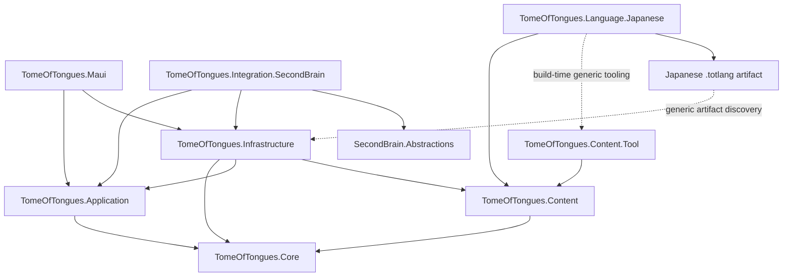

# TomeOfTongues Architecture

- Status: Accepted
- Date: 2026-07-23
- Technical name: `TomeOfTongues`
- Display name: **Tome of Many Tongues**

## 1. Executive recommendation

TomeOfTongues is a private, local-first .NET 10 learning engine with declarative
language packs. The first pack is Japanese, but no production or generic test
project may reference a `TomeOfTongues.Language.*` project, assembly, namespace,
or type.

`TomeOfTongues.Language.Japanese` is an independently built authoring project.
It depends inward on generic content tooling and emits a non-executable
`.totlang` artifact. The runtime understands only the versioned pack contract.
This is the least-general architecture that keeps Japanese knowledge out of the
engine while avoiding reflection-loaded mobile plug-ins and speculative
linguistic abstractions.

The standalone MAUI application is the primary product. SecondBrain integration
is a post-MVP outer adapter over language-neutral application contracts.
SecondBrain never reads the TomeOfTongues database and never owns learning
state.

The first usable release is a substance-first vertical slice: six original
practical Japanese lessons, at least twenty rights-cleared human audio prompts,
persistent progress and review, contextual script exposure, adaptive rōmaji,
Silent Mode, and non-blocking deferred speaking.

## 2. Repository and convention findings

The TomeOfTongues repository began with only `README.md`, a GPL-3.0 license, and
`.gitignore`. It had no solution, projects, tests, workflows, repository
`AGENTS.md`, milestones, issues, or non-default labels.

The related SecondBrain repository provides the nearest established direction:

- .NET 10 and `.slnx`;
- root-level production projects and tests below `tests/`;
- Clean Architecture dependency tests;
- NUnit;
- Microsoft dependency injection;
- a MAUI Shell composition root, currently Android-focused;
- optional products that remain independently buildable and integrate through
  `SecondBrain.Abstractions`;
- explicit `area:*`, architecture, capability, and automation lifecycle labels.

TomeOfTongues follows those stable structural conventions. It does not copy
repository-specific automation scripts or inherit SecondBrain assumptions that
are not implemented there, including a persistence technology or learning
contract.

## 3. Bounded contexts

| Context | Responsibility |
| --- | --- |
| Curriculum | Immutable courses, proficiency bands, units, lessons, steps, objectives, and prerequisites. |
| Language Pack Catalog | Discover, validate, install, version, and remove `.totlang` artifacts. |
| Learning Sessions | Start, resume, traverse, defer, and complete lesson work. |
| Exercises | Interpret generic exercise definitions and record attempts and evidence. |
| Review Scheduling | Maintain independently due objective/skill/representation states. |
| Learner Progress | Track navigation and completion separately from competence evidence. |
| Language Representation | Represent text, scripts, annotations, pronunciation assistance, meanings, and audio without Japanese types. |
| Japanese Authoring | Produce Japanese pack data, readings, rōmaji, furigana, exercises, audio, and source records. |
| Content Sources | Record provenance, attribution, licensing, links, and private-import rights. |
| Statistics | Derive honest local summaries from evidence with samples and measurement types. |
| Privacy | Protect imports, microphone use, notifications, diagnostics, backups, and exports. |
| SecondBrain Integration | Expose redacted, language-neutral application read models through an optional adapter. |

## 4. Project structure and dependency rules

| Project | Responsibility | Allowed project dependencies | Forbidden dependencies | Test project |
| --- | --- | --- | --- | --- |
| `TomeOfTongues.Core` | Domain values, curriculum definitions, sessions, attempts, evidence, progress, review, assistance, and pack descriptors. | None | Every other production project; MAUI, SQLite, and SecondBrain packages | `TomeOfTongues.Core.Tests` |
| `TomeOfTongues.Application` | Commands, queries, DTOs, use cases, repository ports, transaction boundary, and integration read models. | Core | Infrastructure, Content implementation, MAUI, SecondBrain, and every language project | `TomeOfTongues.Application.Tests` |
| `TomeOfTongues.Content` | `.totlang` schema, loading, validation, hashing, rights validation, and mapping into Core definitions. | Core | Application, Infrastructure, MAUI, SecondBrain, and every language project | `TomeOfTongues.Content.Tests` |
| `TomeOfTongues.Content.Tool` | Generic pack and validate CLI for any language source directory. | Content | Language-specific code and MAUI | Content CLI integration tests |
| `TomeOfTongues.Infrastructure` | SQLite, migrations, repositories, filesystem, package catalog, import/export, backup, and recovery. | Core, Application, Content | MAUI, SecondBrain, and every language project | `TomeOfTongues.Infrastructure.Tests` |
| `TomeOfTongues.Maui` | Generic MVVM/Shell host, audio and file-picker adapters, pack selection, learning screens, and composition root. | Application, Infrastructure | Content internals, SecondBrain, and every language project | Direct project build and UI smoke scenarios |
| `TomeOfTongues.Language.Japanese` | Japanese pack source, manifests, lessons, representations, audio, and rights ledger; emits `.totlang`, not a public runtime assembly. | Generic Content tooling | Application, Infrastructure, MAUI, and SecondBrain | Artifact tests below |
| `TomeOfTongues.Language.Japanese.Tests` | Compile and load the Japanese artifact through generic Content APIs. | Core, Content | A runtime assembly reference to the Japanese project | Self |
| `TomeOfTongues.Integration.SecondBrain` | Optional module registration and mapping from generic application read models to host contracts. | Application, Infrastructure, `SecondBrain.Abstractions` | MAUI, every language project, direct SQL, and database paths | `TomeOfTongues.Integration.SecondBrain.Tests` |
| `TomeOfTongues.Architecture.Tests` | Inspect project references, packages, namespaces, artifacts, and naming. | None required | Product behavior | Self |

The solution entry point is `TomeOfTongues.slnx`. A
`TomeOfTongues.NonMaui.slnf` provides the normal non-GUI verification path.

## 5. Dependency map



The artifact edge is not a project, package, namespace, or code dependency.
Generic build tooling discovers all projects declaring
`TomeLanguagePack=true`, builds them independently, and stages their `.totlang`
outputs under `artifacts/language-packs`. MAUI includes every valid artifact
from that generic location without knowing pack names or language tags.

## 6. Core domain model

### Aggregates and entities

- `LearningSession`: course/lesson position, completed, skipped, and deferred
  steps, and a session-mode snapshot.
- `LearnerProgress`: enrollment, unlocks, completion, and last position.
- `ExerciseAttempt`: prompt conditions, response, assistance, latency,
  confidence, outcome, and emitted evidence.
- `LearnerSkillState`: evidence for one objective, skill dimension, and
  optional representation or grapheme.
- `ReviewState`: due time, interval, scheduler version, difficulty/ease,
  streak, and lapses.
- `DeferredSpeakingQueue`: optional speaking opportunities and their state.
- `LearnerPreferences`: Silent Mode and assistance settings.
- `InstalledLanguagePack`: pack identity, version, compatibility, integrity,
  origin, and install state.
- `ContentSourceRegistration`: provenance, license, attribution, and rights.

### Value objects

Stable typed IDs identify packs, courses, units, lessons, steps, exercises,
objectives, sessions, attempts, representations, and assets. Other values
include `LanguageTag`, `ScriptTag`, `TextDirection`, `SkillDimension`,
`PromptModality`, `ResponseModality`, `AssistanceKind`, `AttemptOutcome`,
`ResponseLatency`, `ConfidenceRating`, `ReviewRating`, `ContentVersion`, and
`SchemaVersion`.

### Services and ports

Domain services are `LessonProgressionPolicy`, `EvidenceAttributionService`,
`ReviewScheduler`, `RepresentationAssistancePolicy`, `LearningSessionPlanner`,
and `DeferredSpeakingPolicy`.

Application use cases cover today planning, lesson start/resume, response
submission, silent completion, review, speaking deferral/completion, settings,
statistics, pack installation, private import, backup/export, and integration
read models. Application-owned repository ports cover curriculum, sessions,
progress, attempts, skill states, review, preferences, speaking queues, sources,
and an atomic unit of work.

## 7. Language-extension strategy

The engine supports only declarative capabilities proven by Japanese:

- BCP 47 language and script tags;
- multiple representations of one expression;
- text direction;
- range-based annotations;
- authored transliteration and pronunciation representations;
- authored literal and natural meanings;
- authored acceptable-answer variants;
- allow-listed Unicode, punctuation, and whitespace normalization;
- prompt and response modalities;
- assistance groups and policies;
- representation/grapheme familiarity;
- audio references.

Japanese supplies surface text, hiragana, katakana, rōmaji and its scheme,
furigana/readings, kanji targets, acceptable variants, exercises, and ordering
as data. The MVP does not compute Japanese transliteration or infer furigana.

Do not introduce generic morphology, grammar, conjugation, politeness, counter,
pitch-accent, gender, or handwriting APIs. If a second language proves a
missing capability, add the smallest capability supported by both concrete
cases.

A later non-production Hebrew-shaped fixture validates `he-Hebr`, `he-Latn`,
right-to-left text, optional vowel annotations, and pronunciation assistance.
It does not create a Hebrew module or course.

## 8. SecondBrain integration

TomeOfTongues runs fully without SecondBrain. The post-MVP adapter is opt-in and
language-neutral.

`TomeOfTongues.Application` exposes:

- `ILearningRecommendationQuery`;
- `ILearningProgressSummaryQuery`;
- `IStudyOpportunityQuery`;
- `IDeferredSpeakingOpportunityQuery`;
- `IActivityCompletionFeed`.

Results are immutable DTOs containing opaque IDs, titles, pack IDs, due times,
duration estimates, skill categories, privacy flags, timestamps, completion
IDs, and launch tokens. They exclude repositories, entities, database paths,
raw answers, imported private text, and recordings.

The completion feed is cursor-based and idempotent. SecondBrain consumes
Tome-owned completion records; it does not manufacture attempts. Required
host-owned provider contracts must be frozen in `SecondBrain.Abstractions`
before the adapter is implemented.

An embedded SecondBrain installation receives a module-private storage root and
uses Tome Infrastructure. Standalone and embedded installations have separate
local state; movement is explicit export/import, never shared-database access.

## 9. Persistence

Infrastructure owns `tomeoftongues.db3` below the host-provided app-private
storage root. Use `Microsoft.Data.Sqlite` with explicit SQL repositories and
numbered migrations.

SQLite stores pack metadata, preferences, sessions, progress, attempts,
evidence, skill/review states, speaking queues, source metadata, and the
integration completion outbox. Pack files, audio, and imported assets remain
app-private files rather than blobs.

Migrations use a `schema_migrations` table, serialized startup coordination,
transactions where supported, WAL checkpointing, integrity checks, and a
recoverable backup before destructive operations. Failure rolls back and
offers read-only export/recovery; learner data is never silently recreated.

Export is a versioned ZIP with manifest, logical learner JSON, pack references,
checksums, and explicitly selected private assets. Private assets are excluded
by default. The MVP relies on app sandbox and device encryption; application
database encryption is post-MVP.

## 10. Content and learning-material architecture

A `.totlang` file is ZIP-compatible and contains:

```text
manifest.json
course/courses.json
course/lessons/*.json
assets/audio/*
assets/images/*
licenses/sources.json
licenses/LICENSES.md
checksums.json
```

The manifest records package/schema versions, minimum engine version, language
and locale tags, display names, representations, normalization operations,
courses, licenses, attribution, and checksums.

The hierarchy is pack, course, proficiency band, unit, lesson, step, and
exercise. Steps are explanation, contextual exposure, exercise, checkpoint,
external resource, or optional speaking opportunity.

Expressions contain script-tagged representations, natural and literal
meanings, range annotations, audio references, and sources. Exercises declare
generic type, modalities, targets, acceptable answers, assistance, scoring,
evidence mapping, and speaking deferral. Schema validation rejects any speaking
step that gates progress.

### Sourcing the first course

The starter course is authored originally for TomeOfTongues. The Japan
Foundation task-oriented framework may guide outcomes, but published lessons,
dialogues, exercises, and audio are not copied.

The six MVP situations are greetings/names; attention, thanks, and apologies;
ordering/requesting; numbers and a basic price; asking location; and asking for
repetition or slower speech.

Each lesson includes an original dialogue, natural/literal meanings, readings,
rōmaji, contextual annotations, listening-first work, recognition/recall,
silent production, optional speaking, review items, and only necessary usage
notes.

The pack requires at least twenty human-recorded audio prompts. Contributors
grant edit/package/redistribution rights and provide attribution. Original
lesson text and audio default to CC BY-SA 4.0, separately from GPL-3.0 code.
TTS is prototype-only unless the exact service and voice terms permit
redistribution and are recorded in the source ledger.

A competent Japanese reviewer verifies naturalness, register, pronunciation,
meaning, readings, rōmaji consistency, acceptable variants, contextual script
progression, and source independence. Without review, the pack is an internal
preview rather than a reviewed release.

Every bundled asset must have origin, author, reviewer, license, attribution,
redistribution/modification flags, date, checksum, and review status. The pack
compiler rejects incomplete rights records. Protected external courses are
link-only unless their exact license permits redistribution. No scraping or
private-import commits are allowed.

## 11. Learning and review model

Exposure, demonstrated ability, curriculum completion, and scheduling are
different facts.

Evidence dimensions are recognition, recall, listening comprehension, reading
recognition, silent production, and spoken production. Exposure is counted but
is not competence evidence.

Every observation records objective/representation, modalities, assistance,
correctness, latency, confidence, timestamp, and pack/item revision. Script
familiarity is generic state keyed by representation and grapheme IDs; Core has
no kana, kanji, furigana, or rōmaji types.

Listening failures affect listening only when audio is essential. Script
failures affect representation recognition. The review scheduler keeps
separate state per objective/skill/representation, even when one exercise
combines work. Scheduler algorithm and parameters are versioned.

## 12. Rōmaji and contextual script policy

Pack data associates rōmaji with an assistance group. The generic
`RepresentationAssistancePolicy` returns a presentation decision; MAUI only
renders it.

- **Always show:** assistance is visible where supplied.
- **Adaptive:** visible initially, then revealable/hidden after at least eight
  eligible independent observations, 85% success, acceptable median latency,
  and no more than one recent lapse.
- **Tap to reveal:** hidden until requested.
- **Never show:** never rendered automatically or after errors.

Adaptive assistance returns after two recognition errors in the latest five
eligible observations or a reveal followed by failure. Thresholds are
configuration, not UI constants.

The Japanese pack identifies hiragana, katakana, kanji contexts, and graphemes.
Script mistakes create targeted evidence/review but never lock a lesson. Kanji
appears with contextual readings and meanings. Handwriting is not required.

## 13. Silent Mode

Silent Mode is a persisted generic policy with a per-session override:

- no automatic audio;
- no automatic microphone request;
- manual audio remains available;
- speaking offers silent completion or deferral;
- deferral completes the step without spoken evidence;
- deferred items persist indefinitely without blocking lessons or reviews;
- later completion adds spoken evidence without rewriting lesson completion;
- speaking notifications are off by default and contain no private text.

## 14. Statistics

Useful statistics include scheduled-review retention with sample and period,
recall/latency by skill, due/overdue workload, representation recognition,
assistance reliance, audio-only listening, separately labelled silent and
self-reported spoken production, active study days, meaningful attempts, and
speaking backlog size/age.

Measured, self-reported, and estimated values are labelled. Avoid global
fluency percentages, CEFR mastery from completion, exposure-as-recall,
unqualified speaking accuracy, accuracy without sample size, punitive streaks,
competitive rankings, and background app-open time.

## 15. Privacy

There is no account, mandatory backend, cloud sync, or external analytics.
Diagnostics are local and exclude raw answers, private text, and recordings by
default. Microphone use is explicit and recordings are not persisted by
default. Notifications reveal no imported or lesson text.

Private imports are copied to app-private storage, hashed, marked
non-redistributable, excluded from Git and normal diagnostics, deletable with
derived data, and exported only by explicit choice.

## 16. MVP, post-MVP, and exclusions

### Three-day usable MVP

- Android MAUI build with pack selection, Today, Lesson, Review, Speaking
  Queue, Settings, and Legal/Sources.
- Six original practical lessons, 30–45 minutes, at least twenty reviewed audio
  prompts, and at least thirty scored interactions.
- Listening, recognition, recall, and silent-production exercises.
- Contextual hiragana/katakana and at least one contextual kanji example.
- Four rōmaji modes, Silent Mode, and persistent deferred speaking.
- SQLite-backed resume, progress, attempts, review, and settings.
- Minimal useful progress summary and full content-rights metadata.
- No runtime network requirement.

### Post-MVP

Complete A1/A2 content, private-import UI, rich insights, backup/restore UI,
additional platform release verification, optional non-gating speech
recognition, SecondBrain integration, and the Hebrew-shaped validation fixture.

### Deliberately excluded

Backend/accounts/cloud sync, external analytics, handwriting recognition,
mandatory speaking, protected-content scraping/redistribution, automatic CEFR
certification, a public course marketplace, a production Hebrew course, and
cross-app direct database sharing.

## 17. Risks and trade-offs

- Premature generalization: require a concrete second-language need before new
  linguistic capability.
- Japanese leakage: enforce project, namespace, artifact, and source rules.
- Content quality/cost: treat reviewed original material and audio as a release
  gate, not polish.
- Copyright: reject incomplete rights records and link protected resources.
- SecondBrain coupling: adapter-only references and standalone builds.
- Speech complexity: self-assessment and indefinite deferral in MVP.
- Misleading statistics: retain evidence and display samples/measurement type.
- Migration loss: backup, integrity checks, rollback, and recovery export.
- MAUI differences: Android-first verification without claiming other releases.
- Private-to-public risk: non-redistributable imports and explicit exports.
- Over-engineering: no executable plug-in loader, backend, event bus, or
  universal grammar framework.

## 18. Architecture decisions and verification

Accepted decisions are recorded in `docs/architecture/adr/0001` through `0011`.

Non-MAUI verification:

```powershell
dotnet restore TomeOfTongues.NonMaui.slnf
dotnet build TomeOfTongues.NonMaui.slnf --configuration Debug --no-restore
dotnet test TomeOfTongues.NonMaui.slnf --configuration Debug --no-build --no-restore
```

Pack verification:

```powershell
dotnet run --project TomeOfTongues.Content.Tool/TomeOfTongues.Content.Tool.csproj -- pack --source TomeOfTongues.Language.Japanese --output artifacts/language-packs
dotnet run --project TomeOfTongues.Content.Tool/TomeOfTongues.Content.Tool.csproj -- validate artifacts/language-packs
dotnet test tests/TomeOfTongues.Language.Japanese.Tests/TomeOfTongues.Language.Japanese.Tests.csproj
```

MAUI verification:

```powershell
dotnet workload restore TomeOfTongues.Maui/TomeOfTongues.Maui.csproj
dotnet restore TomeOfTongues.Maui/TomeOfTongues.Maui.csproj
dotnet build TomeOfTongues.Maui/TomeOfTongues.Maui.csproj --configuration Debug --framework net10.0-android --no-restore
```

Architecture tests must reject all generic-to-language references, executable
assemblies in packs, Japanese identifiers in generic source, direct SecondBrain
database access, MAUI Japanese conditionals, and gating speaking/script work.

## 19. Milestones, issue sizing, and acceptance answers

Milestone themes are repository foundation; generic pack platform; core
learning; Japanese starter course/audio; local progress/review; contextual
assistance/Silent Mode; MAUI usable experience; insights/import/portability;
SecondBrain integration; and MVP hardening.

Every later issue has one primary outcome, is independently verifiable, names
prerequisites, avoids unrelated layers, and normally fits one automation cycle.
Split domain contracts, persistence, MAUI, migrations, content authoring, and
SecondBrain integration unless one coherent outcome requires a narrow
cross-layer slice. Use multiple area labels when necessary and never
`area:fullstack`.

Architecture acceptance:

1. TomeOfTongues runs without SecondBrain: **yes**.
2. SecondBrain consumes recommendations without database access: **yes**.
3. Removing Japanese leaves the generic engine buildable: **yes**.
4. A future language may declare different representations: **yes**.
5. Speaking may remain deferred indefinitely: **yes**.
6. Rōmaji visibility is policy-driven rather than a UI conditional: **yes**.
7. Third-party resources may be referenced without bundling: **yes**.
8. Private imports stay local and outside Git: **yes**.
9. Statistics distinguish exposure from recall: **yes**.
10. The display name may change without assembly renames: **yes**.

Remaining human approvals are limited to actual Japanese reviewer/contributor
availability, final signing identity, and the future
`SecondBrain.Abstractions` contract version. They do not change the accepted
dependency architecture.
